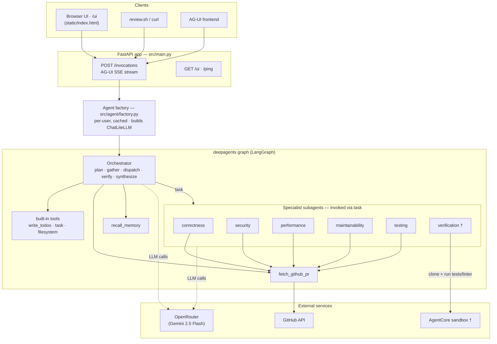
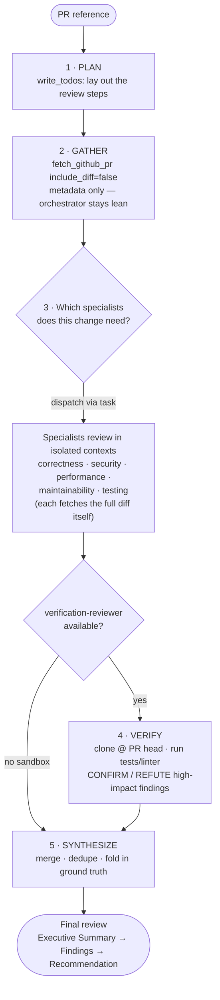
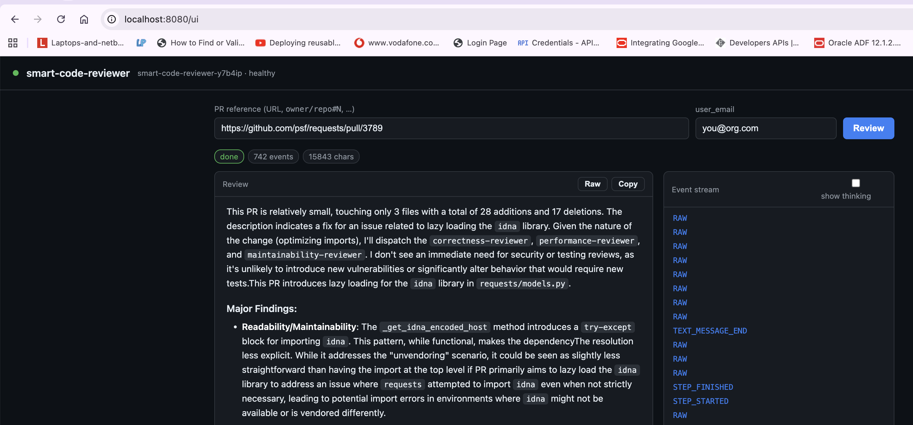
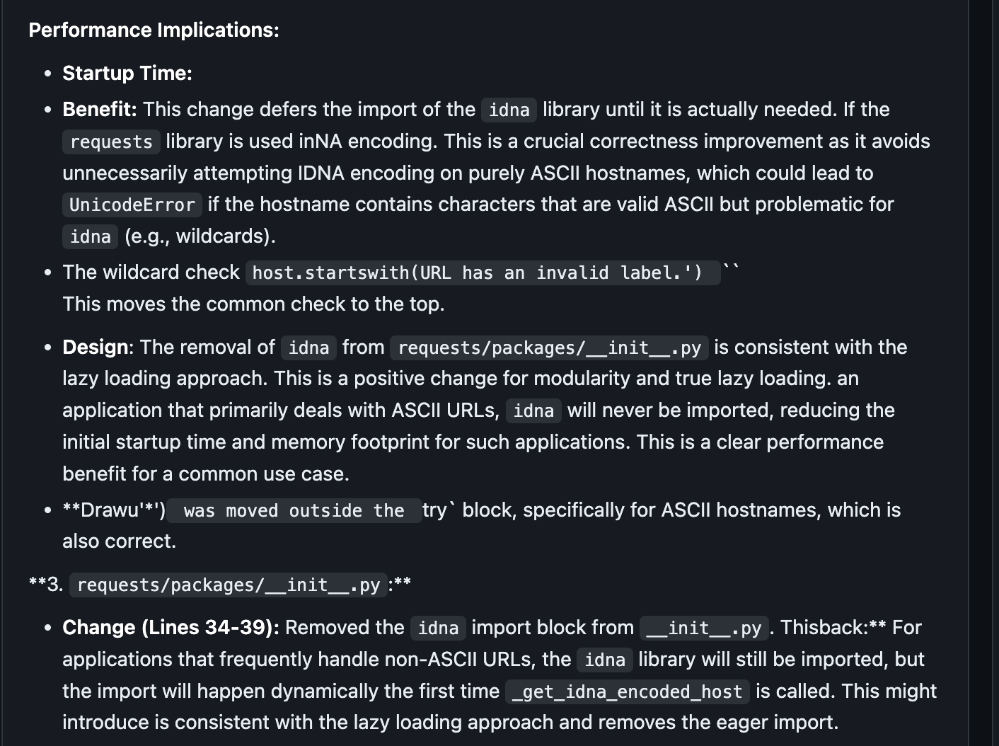
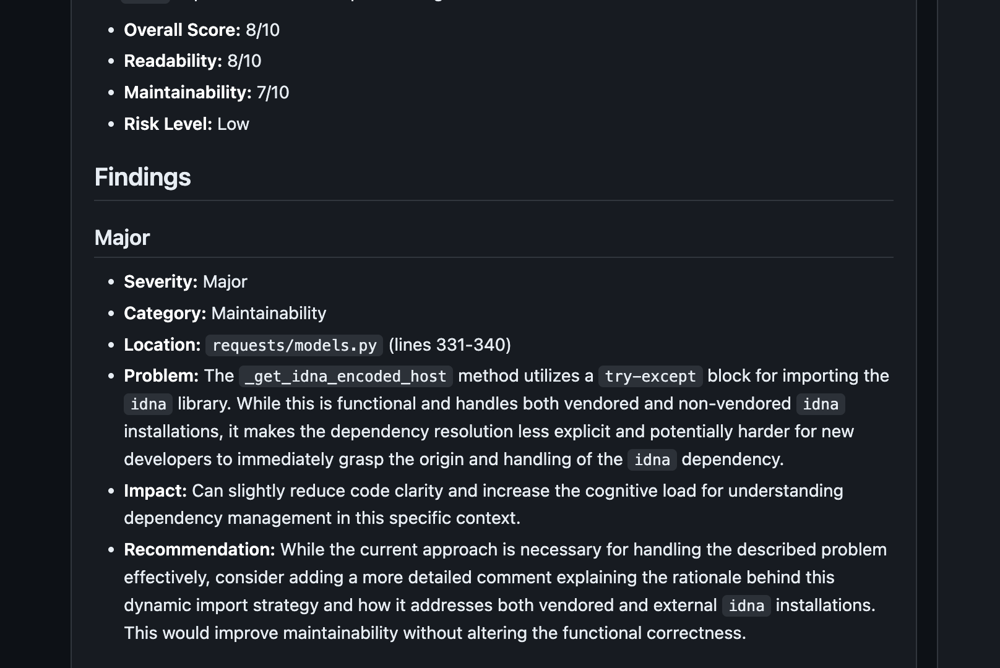
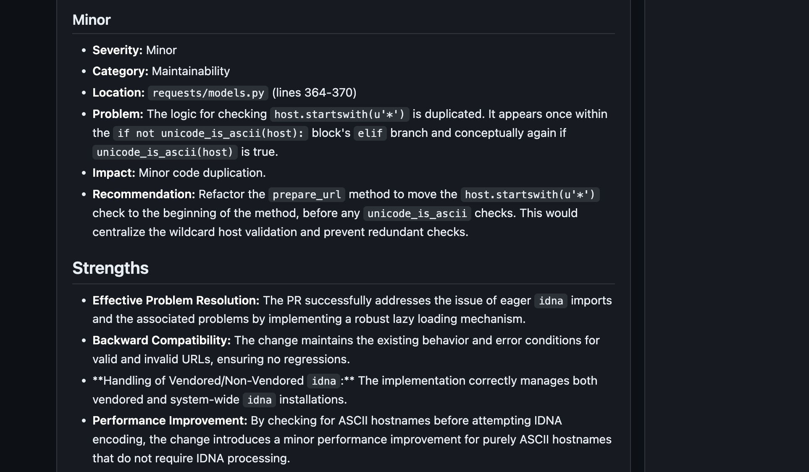
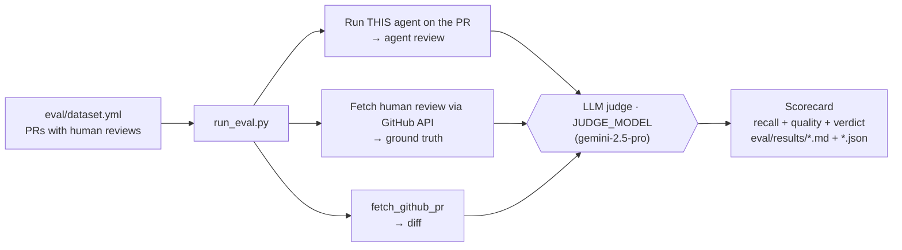

# smart-code-reviewer

An AI code-review agent. Give it a GitHub pull-request reference and it returns a
structured senior-staff review: scored Executive Summary → severity-categorized
findings → Final Recommendation (APPROVE / APPROVE WITH COMMENTS / REQUEST CHANGES / BLOCK).

- **Framework:** deepagents (LangGraph) · **Protocol:** AG-UI · **Runtime:** AgentCore
- **Review tool:** `fetch_github_pr` ([src/tools/github_pr.py](src/tools/github_pr.py))

## Architecture

A request enters the FastAPI app, which builds (and caches) a per-user deepagents graph.
The graph is a lean **orchestrator** that delegates to **specialist subagents** via the
`task` tool; the specialists and the orchestrator reach the outside world (GitHub,
OpenRouter, an optional sandbox) through tools.



† The `verification` subagent and the sandbox exist only when `CODE_INTERPRETER_ID` is
set; otherwise the agent reviews statically.

### The review loop

Each review is an explicit agentic loop — plan, gather, decide what's needed, delegate,
optionally verify by running the code, then synthesize:



## How it reviews — plan-first, multi-agent

Rather than one prompt doing everything, the reviewer is a small **orchestrator +
specialists** system that runs an explicit agentic loop:

1. **PLAN** — the orchestrator writes a todo list (`write_todos`) of the review steps.
2. **GATHER** — it calls `fetch_github_pr` with `include_diff=False` to pull *only*
   the PR metadata + changed-file list, so it can size and route the change without
   loading the (up to 200k-char) diff into its own context.
3. **DISPATCH** — based on scope and risk it **decides which specialists to run** and
   delegates to them via the `task` tool. Each specialist fetches the full diff into
   its *own* isolated context and reviews a single dimension.
4. **VERIFY** *(when a sandbox is provisioned)* — for high-impact findings ("this
   breaks test X", "this will crash"), it dispatches the `verification-reviewer`,
   which **clones the repo at the PR head and actually runs the tests/linter** to
   confirm or refute the claim with real output. No guessing where it can check.
5. **SYNTHESIZE** — it merges, de-duplicates, and weighs the findings (folding in the
   verifier's ground truth) into one report, then gives the verdict. Output scales to
   the change (a typo fix isn't padded with a full per-dimension essay).

| Component | Prompt | Role |
|---|---|---|
| Orchestrator | [smart-code-reviewer-y7b4ip.md](src/agent/prompts/smart-code-reviewer-y7b4ip.md) | Plan → gather → dispatch → synthesize |
| `correctness-reviewer` | [specialists/correctness.md](src/agent/prompts/specialists/correctness.md) | Logic, edge cases, error handling, concurrency, data integrity |
| `security-reviewer` | [specialists/security.md](src/agent/prompts/specialists/security.md) | Injection, secrets, auth/authz, unsafe deserialization, OWASP |
| `performance-reviewer` | [specialists/performance.md](src/agent/prompts/specialists/performance.md) | Complexity, N+1 queries, caching, allocations, chatty I/O |
| `maintainability-reviewer` | [specialists/maintainability.md](src/agent/prompts/specialists/maintainability.md) | Readability, naming, SOLID/DRY, coupling, architecture |
| `testing-reviewer` | [specialists/testing.md](src/agent/prompts/specialists/testing.md) | Test coverage, edge/error-path tests, observability |
| `verification-reviewer` † | [specialists/verification.md](src/agent/prompts/specialists/verification.md) | Clones the repo at the PR head, runs tests/linter, confirms/refutes findings with real output |

† The `verification-reviewer` is added **only when an execution sandbox is provisioned**
(`CODE_INTERPRETER_ID` set). Without a sandbox the agent reviews statically and never
claims to have run anything. This is the "do what a real reviewer does — run the tests"
capability, modeled on how coding agents ground their work by executing rather than
guessing; it needs sandbox network egress to clone and install.

Specialists are wired up in [src/agent/factory.py](src/agent/factory.py) and listed in
[src/agent/prompts/__init__.py](src/agent/prompts/__init__.py); `write_todos`, the
shared filesystem, and the `task` delegation tool are provided automatically by
deepagents.

---

## Prerequisites

- Python ≥ 3.13 and [`uv`](https://docs.astral.sh/uv/)
- (Optional but recommended) `GITHUB_TOKEN` — without it, GitHub's anonymous API
  limit is 60 requests/hour. A classic/`public_repo` token raises it to 5000/h and
  lets the agent read private repos the token can see.
- An [OpenRouter](https://openrouter.ai) API key. Defaults (see
  [src/config.py](src/config.py)) use OpenRouter with **`google/gemini-2.5-flash`** —
  cheap, ~1M-token context for large diffs, strong at code review. Override via env
  to swap models.

### Configure with a `.env` file

Copy the template and fill in your keys. On startup the `src` package loads this
file automatically (via `python-dotenv`), so you don't need to `export` anything:

```bash
cp .env.example .env
# then edit .env and set OPENROUTER_API_KEY (and optionally GITHUB_TOKEN)
```

Real process environment variables always win over `.env` (`override=False`), so
deployments that inject config the usual way are unaffected. Prefer exporting
instead? That still works:

```bash
export GITHUB_TOKEN=ghp_xxx              # optional (raises GitHub rate limit)
export OPENROUTER_API_KEY=sk-or-xxx      # required for real model calls
# export LLM_MODEL_NAME=deepseek/deepseek-chat   # swap models freely
# export LLM_BASE_URL=...                # point back at another gateway
```

`.env` is git-ignored — keep real secrets there. See [.env.example](.env.example)
for the full list of supported variables.

---

## Run locally

> ⚠️ The generic `just run-agent` recipe targets `src.agent:app`, but this agent's
> FastAPI app lives in `src.main:app`. Use the explicit `uvicorn` command below.

```bash
cd agents/smart-code-reviewer-y7b4ip
uv sync
uv run uvicorn src.main:app --reload --port 8080
```

Server is up when you see `Agent ready` in the logs. Health checks:

```bash
curl -s localhost:8080/ping                  # {"status":"healthy",...}
curl -s localhost:8080/invocations/health     # {"status":"ok",...}
```

### Browser UI

Open **<http://localhost:8080/ui>** for a minimal single-page UI ([static/index.html](static/index.html),
served same-origin by the agent so there's no CORS setup). Paste a PR reference, hit
**Review**, and watch the review stream in live, **rendered as Markdown** (headings,
tables, code blocks, lists) by a small built-in renderer — toggle **Raw** to see the
source, **Copy** to grab the raw Markdown. A side panel shows the raw AG-UI event
stream (tool calls, thinking behind a toggle), plus a stop button. No build step, no
CDN — works offline.



The review renders as formatted Markdown — Executive Summary with scores, then
severity-categorized findings (Severity / Category / Location / Problem / Impact /
Recommendation) and Strengths:

| | |
|---|---|
|  |  |
|  | |

### Send a review request

**Quickest path — `review.sh`.** A helper that posts the request and extracts the
markdown report for you (it drops the SSE framing, tool-call events, and thinking
events, keeping only the assistant's review):

```bash
./review.sh https://github.com/langchain-ai/deepagents/pull/3936   # print to stdout
./review.sh langchain-ai/deepagents#3936 review.md                 # write to a file
```

Requires `jq` and `curl`. Override the endpoint with `AGENT_URL=...` and the caller
identity with `USER_EMAIL=...`. Run `./review.sh --help` for details.

**Raw request.** The agent speaks AG-UI on `POST /invocations`. Minimal request —
ask it to review a real open-source PR:

```bash
curl -N -s localhost:8080/invocations \
  -H 'Content-Type: application/json' \
  -H 'Accept: text/event-stream' \
  -d '{
    "thread_id": "t1",
    "run_id": "r1",
    "messages": [
      {"id": "m1", "role": "user",
       "content": "Review https://github.com/langchain-ai/deepagents/pull/3936"}
    ],
    "tools": [],
    "context": [],
    "state": {},
    "forwarded_props": {"user_email": "you@example.com"}
  }'
```

You'll get a stream of AG-UI SSE events; the assistant text events contain the review.
Accepted PR reference formats: a full `github.com/owner/repo/pull/N` URL,
the short `owner/repo#N` form, or a bare number plus `owner`/`repo`.

The review arrives as a series of `TEXT_MESSAGE_CONTENT` events, each with a `delta`
chunk. To reassemble them into the original markdown — exactly what `review.sh` does —
pipe the stream through `jq`:

```bash
curl -N -s localhost:8080/invocations \
  -H 'Content-Type: application/json' -H 'Accept: text/event-stream' \
  -d '{ ...request body above... }' \
| grep '^data:' | sed 's/^data: //' \
| jq -rj 'select(.type=="TEXT_MESSAGE_CONTENT") | .delta'
```

You can also exercise the fetch tool directly, without the LLM:

```bash
uv run python -c "from src.tools.github_pr import _fetch_pr; \
print(_fetch_pr('langchain-ai/deepagents#3936')[:1500])"
```

### Run via the shared frontend (chat UI)

```bash
just run-frontend      # Next.js + CopilotKit on http://localhost:3000
```

Point it at the locally running agent and chat with it like any other AI-hub agent.

---

## Test

```bash
# this agent only
just test-agent smart-code-reviewer-y7b4ip
# or directly:
cd agents/smart-code-reviewer-y7b4ip && uv sync --extra dev && uv run pytest -v
```

What's covered:
- [tests/test_github_pr.py](tests/test_github_pr.py) — PR-reference parsing matrix
  (URL / short form / bare number / garbage) and the fetch/format paths with the
  network **stubbed** (happy path, 404, diff truncation, `include_diff=False`,
  bad-reference handling). Runs fully offline and deterministically.
- [tests/test_smoke.py](tests/test_smoke.py) — every module imports and exposes its
  builder; the orchestrator + 5 specialist prompts load, the factory assembles the
  subagent roster, and the `verification-reviewer` is added only when a sandbox is
  provisioned.

### Lint & format (CI-style, deterministic)

```bash
just fmt          # black
just lint         # ruff
just fmt-check    # black --check + ruff (what CI runs)
```

---

## Evaluation (LLM as judge)

[eval/](eval/) measures review quality by comparing the agent's output to **real human
reviews** on merged PRs. The human review is ground truth; an LLM judge scores how much
of it the agent caught (**recall**) plus standalone **quality**. See [eval/README.md](eval/README.md).



```bash
uv run python eval/run_eval.py --dry-run     # fetch+print the human reviews (no key needed)
uv run python eval/run_eval.py               # full run (needs OPENROUTER_API_KEY; JUDGE_MODEL configurable)
```

---

## Docker (mirrors the deployed image)

Build/run from the **repo root** — the Dockerfile references `agents/<name>/` and `skills/`:

```bash
just build smart-code-reviewer-y7b4ip
just run-docker smart-code-reviewer-y7b4ip 8080
```

## Deploy

```bash
just deploy-dev smart-code-reviewer-y7b4ip    # AgentCore dev
```

---

## Configuration reference

| Env var             | Default                          | Purpose                                  |
|---------------------|----------------------------------|------------------------------------------|
| `LLM_BASE_URL`      | `https://openrouter.ai/api/v1`   | OpenRouter (OpenAI-compatible) base URL  |
| `OPENROUTER_API_KEY` / `LLM_API_KEY` | _(empty)_      | OpenRouter key (required for real runs)  |
| `LLM_MODEL_NAME`    | `google/gemini-2.5-flash`        | Model used for the review                |
| `LLM_REASONING_EFFORT` | _(empty)_                     | `low`/`medium`/`high` — only for reasoning models; left unset for Gemini |
| `GITHUB_TOKEN`      | _(empty)_                        | Raises GitHub API rate limit; reads private repos |
| `GITHUB_HTTP_TIMEOUT` | `30`                           | Per-request timeout (seconds) for the PR fetch |
| `CODE_INTERPRETER_ID` | _(empty)_                      | AgentCore sandbox id. When set, enables the `verification-reviewer` (clone + run tests/linter). Unset = static review only. |
